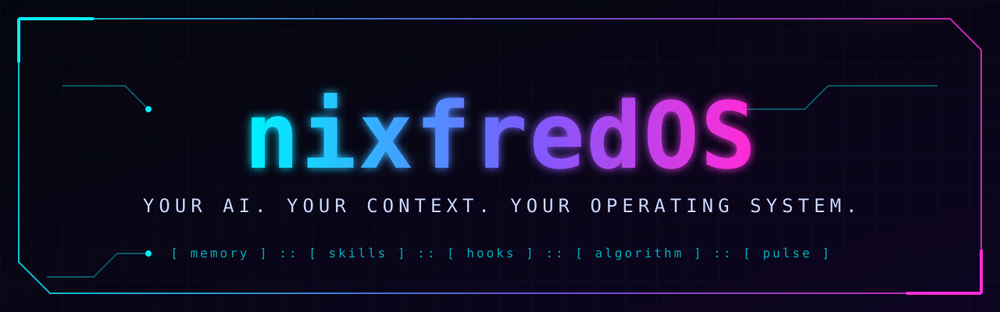
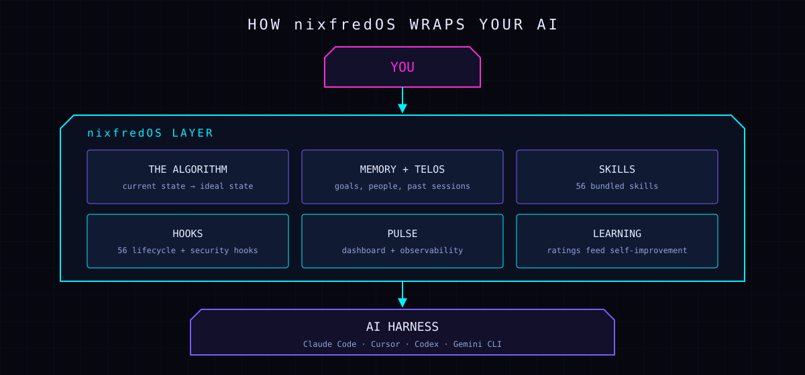

<p align="center">
  
</p>

<p align="center">
  <a href="https://github.com/nixfred/nixfredOS"></a>
  
  
  
</p>

# nixfredOS

🌐 **https://nixfredos.com**

**nixfredOS turns a general AI coding harness into a personal operating system.** It learns your goals, remembers your past sessions, routes each request to the right skill, and guards your machine with hooks that check every action before it runs.

Your harness is the engine. nixfredOS is the rest of the car.

<p align="center">
  
</p>

## Install

nixfredOS installs itself. Clone the repo, then hand the install guide to your AI:

```bash
git clone https://github.com/nixfred/nixfredOS.git
cd nixfredOS
```

Then tell your AI coding assistant:

```
Read nixfredOS/INSTALL.md and install nixfredOS for me.
```

It walks the setup and asks before it touches anything on your machine. You need a coding harness that can read files and run commands (built and tested on [Claude Code](https://docs.claude.com/claude-code)) and [bun](https://bun.sh).

## What you get

| Component | What it does |
|---|---|
| **The Algorithm** | Every task moves from *current state* to a defined *ideal state*, with criteria you can verify |
| **Memory + TELOS** | Goals, people, preferences and past decisions, available without re-explaining |
| **Skills** | 56 bundled skills: research, security, writing, art, first principles, red teaming and more |
| **Hooks** | 56 lifecycle hooks: security guards, integrity checks, context loading, learning capture |
| **Pulse** | Local dashboard and observability for what your AI is doing |
| **Status line** | Neon 5-line cockpit: context, git, memory, plan pace (banked, never dollars), local GPU and weather. Adapts to pane size |
| **Learning** | Ratings and outcomes feed back so the system improves itself |

Browse the skills in [`nixfredOS/install/skills/`](nixfredOS/install/skills/) and the hooks in [`nixfredOS/install/hooks/`](nixfredOS/install/hooks/).

## FAQ

**Which harness does it run on?**
Claude Code is the most tested path. The install guide is written so any capable coding assistant (Cursor, Cline, Codex, Gemini CLI) can follow it.

**What if I break something?**
The install is additive. It writes its own files and asks before each integration step, so your existing setup stays in place.

**How is this different from Fabric?**
[Fabric](https://github.com/danielmiessler/fabric) is a library of prompts for specific tasks. nixfredOS is the system around your AI: memory, routing, guards and learning. It bundles Fabric patterns as one of its skills.

## Repository layout

```
nixfredOS/
├── README.md          you are here
├── LICENSE            MIT (original, unmodified)
├── images/            banner and diagrams
├── Releases/          versioned release snapshots
└── nixfredOS/
    ├── INSTALL.md     the AI-readable install guide
    ├── GETTING-STARTED.md
    └── install/       skills, hooks, agents, settings, tools
```

## License

MIT. See [LICENSE](LICENSE). The original license file is kept exactly as published upstream.

---

<sub>nixfredOS is a fork of <a href="https://github.com/danielmiessler/LifeOS">LifeOS</a> by <a href="https://danielmiessler.com">Daniel Miessler</a>, used under the MIT License. Thanks to Daniel and the LifeOS contributors for the foundation.</sub>
