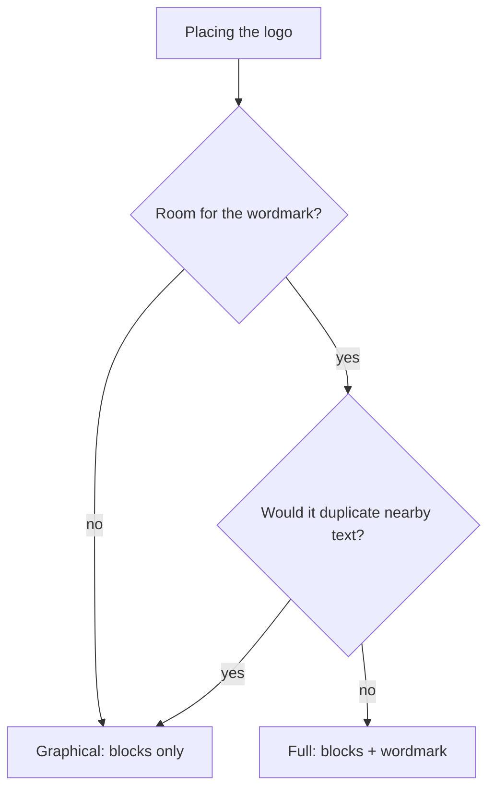

# nixfredOS Brand Assets

Canonical logo naming for the whole nixfredOS project. Use these names everywhere — docs, repos, site, release, design files.

## The logos

| Name | What it is | File | Use it for |
|------|-----------|------|------------|
| **nixfredOS Banner** | Neon `nixfredOS` wordmark in a chamfered frame | `images/nixfredos-banner.svg` | README header, social cards, slides. |
| **nixfredOS Icon** | The `nf` glyph in a chamfered gradient square | `images/nixfredos-icon.svg` | Square placements: favicons, app icon (Pulse MenuBar `icon.png`), Pulse header logo, avatars. |
| **Architecture diagram** | How nixfredOS wraps your AI | `images/nixfredos-architecture.svg` | Docs and README. |

## Colors

Cyan `#00f0ff` → violet `#7a5cff` → magenta `#ff2bd6` gradient on near-black `#07070f`. Monospace type (JetBrains Mono, Fira Code, Menlo fallback).

## Rules

- **SVG is the source of truth.** PNGs are exports for placement only: `rsvg-convert -w 512 -h 512 images/nixfredos-icon.svg -o icon.png`.
- **Never AI-generate these.** Author and edit them as precise SVG with the exact brand colors.
- Keep filenames stable so references don't drift.

## Where they live

- Site: `nixfredos.com`.
- Public repo: `images/` (banner, icon, architecture). Pulse PNG exports: `NIXFREDOS/PULSE/MenuBar/icon*.png`, `NIXFREDOS/PULSE/Observability/{public,out}/nixfredos-logo.png`.

---

## Examples

### Picking a logo for four placements

The rule is one question — *is there room for the wordmark, and would it duplicate text that's already there?* — applied to whatever you're placing.

- **Site nav, top-left.** Plenty of room, no other "nixfredOS" text beside it → **Full** (blocks + wordmark). This is the default, and most placements are this.
- **Favicon / browser tab.** A 16-pixel square can't hold a wordmark → **Graphical** (blocks only).
- **A hero section whose headline already says "nixfredOS" in big type.** There's room, but the wordmark would just repeat the headline → **Graphical**, so the mark and the text aren't saying the same word twice.
- **Release README header.** Room, no adjacent wordmark → **Full**.

### The case that trips people up

Tight space is the obvious reason to reach for Graphical. The subtler one is duplication: even with plenty of room, if a wordmark sits next to text that already reads "nixfredOS," Full makes the page stutter, and Graphical is the right call. When neither condition holds, Full wins by default — you never pick Graphical just because it looks cleaner in isolation.

### The choice as a picture

Two questions, one default: Full unless space or duplication rules it out. That is the entire logo-selection policy in a single fork.
